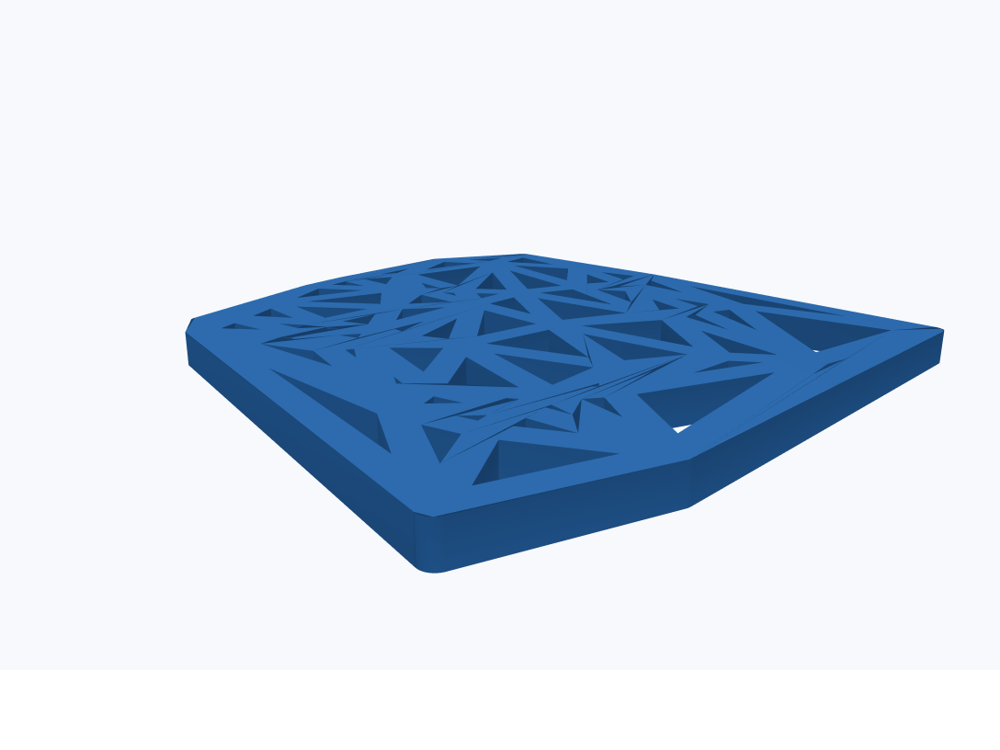
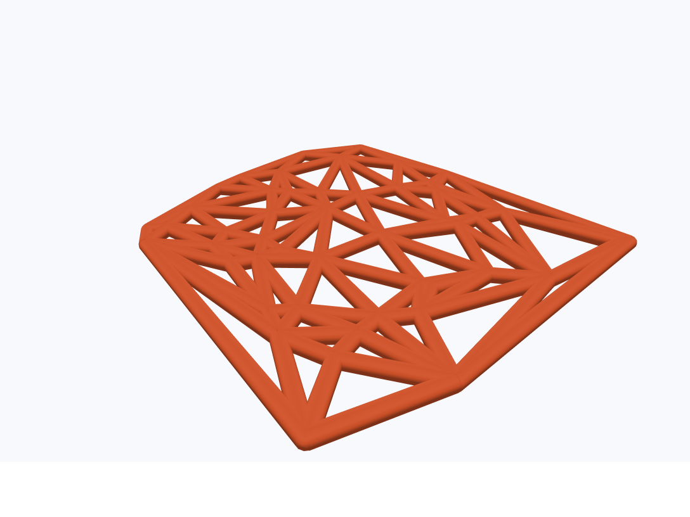
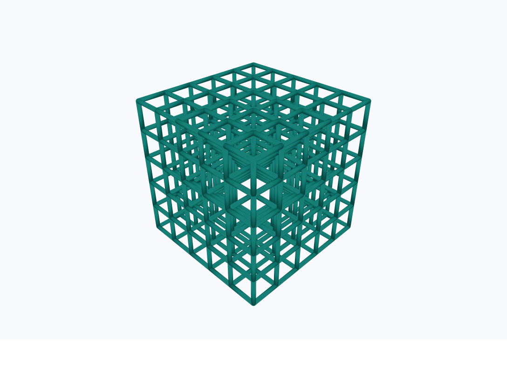

# STL Generation for Network Data

Convert node-and-edge networks into 3D-printable STL meshes. The project
supports planar extrusion for 2D networks, cylindrical beams for 2D or 3D
networks, variable beam thickness, node diameters, multiple materials, and
HTML previews.

## Quick Start

```bash
git clone https://github.com/DMREF-networks/STL_generation_3d.git
cd STL_generation_3d
python -m venv .venv
source .venv/bin/activate
python -m pip install -r requirements.txt
```

On Windows, activate the environment with:

```bat
.\.venv\Scripts\activate
```

Generate the included 2D example with the planar method:

```bash
python generate_2d_stl.py
```

When asked for the input directory, enter `sample_delaunay_2d`.

Use cylindrical beams instead with:

```bash
python generate_3d_stl.py
```

## Geometry Choices

Network dimensionality and meshing method are separate choices:

- **Network dimensionality** describes the input node positions: `(x, y)` or
  `(x, y, z)`.
- **Meshing method** describes the solid geometry placed around those nodes
  and edges.

| Planar method · 2D network | Cylindrical method · 2D network | Cylindrical method · 3D network |
| --- | --- | --- |
|  |  |  |

### Planar Method

The planar method is an **extrusion process**:

1. Each edge becomes a rectangle and each connected node becomes a disc in
   the XY plane.
2. The overlapping 2D shapes are merged into one outline.
3. That outline is extruded along Z to the requested height.

The result is a 3D STL, but the source network must be flat. Use
`generate_2d_stl.py` for this method.

### Cylindrical Method

The cylindrical method creates a cylinder for each edge and a sphere at each
connected node. It accepts either kind of input:

- With 2D positions, the beam centerlines remain in one plane.
- With 3D positions, the network extends through X, Y, and Z.

Use `generate_3d_stl.py` for this method.

| Input positions | Available methods |
| --- | --- |
| 2D `(x, y)` | Planar or cylindrical |
| 3D `(x, y, z)` | Cylindrical only |

## Input Files

Every network needs:

- node positions (`xy`)
- connectivity (`adj`)
- optional per-node diameters (`node_diameters`)

The interactive scripts expect a **directory containing a matched pair**, not
an individual file:

```text
network_xy.csv
network_adj.csv
```

NumPy files use the same pattern:

```text
network_xy.npy
network_adj.npy
```

Suffixes are allowed as long as they match, such as `network_xy_0.1.npy` and
`network_adj_0.1.npy`.

Position arrays may have two columns `(x, y)` or three columns `(x, y, z)`.
Two-column positions are placed at `z = 0` automatically.

Connectivity may be a square adjacency matrix or an edge list. Config-driven
edge lists use one of these explicit layouts:

| `edge_list_interpretation` | Columns |
| --- | --- |
| `legacy` | `source, target[, ignored_length]` |
| `thickness` | `source, target, thickness` |
| `material` | `source, target, material_code` |
| `thickness_material` | `source, target, thickness, material_code` |

CSV, NumPy `.npy`, and explicit-schema pickle `.pkl` inputs are supported by
the config-driven workflow.

## Ways to Run

### Browser UI

```bash
python material_stl_ui.py
```

The browser UI provides file pickers and controls for geometry, thickness,
node sizing, material assignment, and output location. Click `Generate STLs`
to create the meshes. Each run also saves a reusable JSON config next to its
outputs.

If a file picker is unavailable, paste the path into the field.

### Simple Interactive Scripts

```bash
python generate_2d_stl.py  # planar extrusion; 2D input only
python generate_3d_stl.py  # cylindrical beams; 2D or 3D input
```

Both scripts ask for the input type, input directory, beam diameter, model
side length, and whether connectivity values control beam thickness. The
planar script also asks for extrusion depth. STL and HTML files are written to
the current directory.

The older combined prompt remains available as:

```bash
python npyToSTLScript.py
```

### Reusable JSON Configs

Use configs for repeatable jobs, edge lists, node diameters, or multiple
materials:

```bash
python config_to_stl.py sample_configs/multimaterial_test.json
```

Config paths are resolved relative to the JSON file. See
[`sample_configs/multimaterial_test.json`](sample_configs/multimaterial_test.json)
for a compact example.

STL does not reliably store material metadata. Multi-material jobs therefore
write one STL per material in the same coordinate frame, ready to import
together into a slicer.

To build a config without running Python, open
[`material_config_builder.html`](material_config_builder.html) in a browser.
The builder downloads JSON; run that config later with `config_to_stl.py`.

## Important Controls

- **Beam diameter** sets the default edge width or diameter in millimeters.
- **Model side length** scales the longest coordinate span to the requested
  size.
- **Variable thickness** applies connectivity weights as
  `edge_diameter = beam_diameter × edge_value`.
- **Extrusion height** sets the Z thickness of planar output.
- **Node diameters** optionally replace automatic junction sizing with one
  absolute diameter per node.
- **Junction material** can be fixed, separated for mixed-material nodes, or
  assigned by the dominant connected material.

By default, a junction matches the thickest beam touching that node. Isolated
nodes do not produce junction geometry.

## Examples

- `sample_delaunay_2d/` — small input for the interactive scripts.
- [`sample_configs/multimaterial_test.json`](sample_configs/multimaterial_test.json)
  — adjacency-matrix material assignment.
- [`sample_configs/delaunay_centroidal_stiffness_practice/`](sample_configs/delaunay_centroidal_stiffness_practice/README.md)
  — edge material codes and node-diameter practice.
- [`sample_configs/voronoi_random_material_demo/`](sample_configs/voronoi_random_material_demo/voronoi_material_demo.json)
  — deterministic two-material Voronoi network.
- `sample_configs/huppi_periodic_a05_demo/` — periodic Gabriel, Delaunay,
  Delaunay-centroidal, and Voronoi examples.

Keep personal inputs and generated files in `local_configs/` and
`local_output/`. Both directories are ignored by Git.

## Checks and Cleanup

Run the regression tests with:

```bash
python -m unittest discover
```

Remove generated caches and older byproducts with `./clean.sh` on Linux/macOS
or `clean.bat` on Windows.
